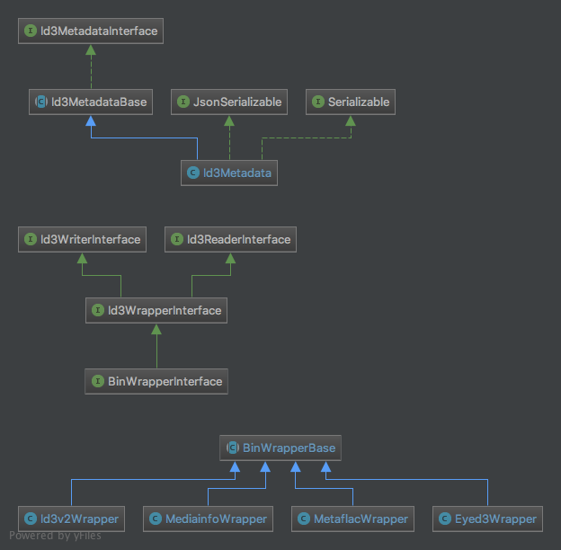

## Docker

### Build docker image

```
docker build -t registry.gitlab.com/pyrex-fwi/sapar-id3:php-7.4 -f ./Dockerfile .
docker push -t registry.gitlab.com/pyrex-fwi/sapar-id3:php-7.4
```

### Fixer

```
docker run -it --rm -v ${PWD}:/sapar-id3 -w /sapar-id3 registry.gitlab.com/pyrex-fwi/sapar-id3:php-7.2 php -n vendor/bin/php-cs-fixer fix --dry-run --verbose --diff
```


https://mediaarea.net/fr/MediaInfo/Download/Debian


curl -o libzen0.deb https://mediaarea.net/download/binary/libzen0/0.4.35/libzen0_0.4.35-1_amd64.Debian_6.0.deb \
&& dpkg -i libzen0.deb

curl -o libmediainfo0_0.deb https://mediaarea.net/download/binary/libmediainfo0/0.7.94/libmediainfo0_0.7.94-1_amd64.Debian_6.0.deb \
&& dpkg -i libmediainfo0_0.deb

curl -o mediainfo.deb https://mediaarea.net/download/binary/mediainfo/0.7.94/mediainfo_0.7.94-1_amd64.Debian_6.0.deb \
&& dpkg -i mediainfo.deb
